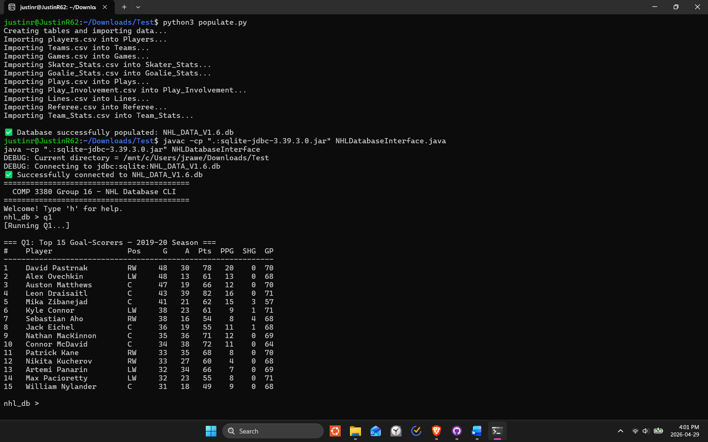

# NHL Statistics Database

A relational database and Java-based interface for querying NHL player and team statistics. Built as a group course project with a focus on database design, SQL querying, and backend-frontend integration.

# How to run
1. Unzip all `.csv` files
2. Ensure that the `populate.py`, `NHLDatabaseInterface.java`, `sqlite-jdbc-3.39.3.0.jar` and all the `.csv` file are all in one directory
3. Create the database
```bash
python3 populate.py
```
5. Run and compile the interface:
```bash
javac -cp ".:sqlite-jdbc-3.39.3.0.jar" NHLDatabaseInterface.java
java -cp ".:sqlite-jdbc-3.39.3.0.jar" NHLDatabaseInterface
```
# screenshot of interface

